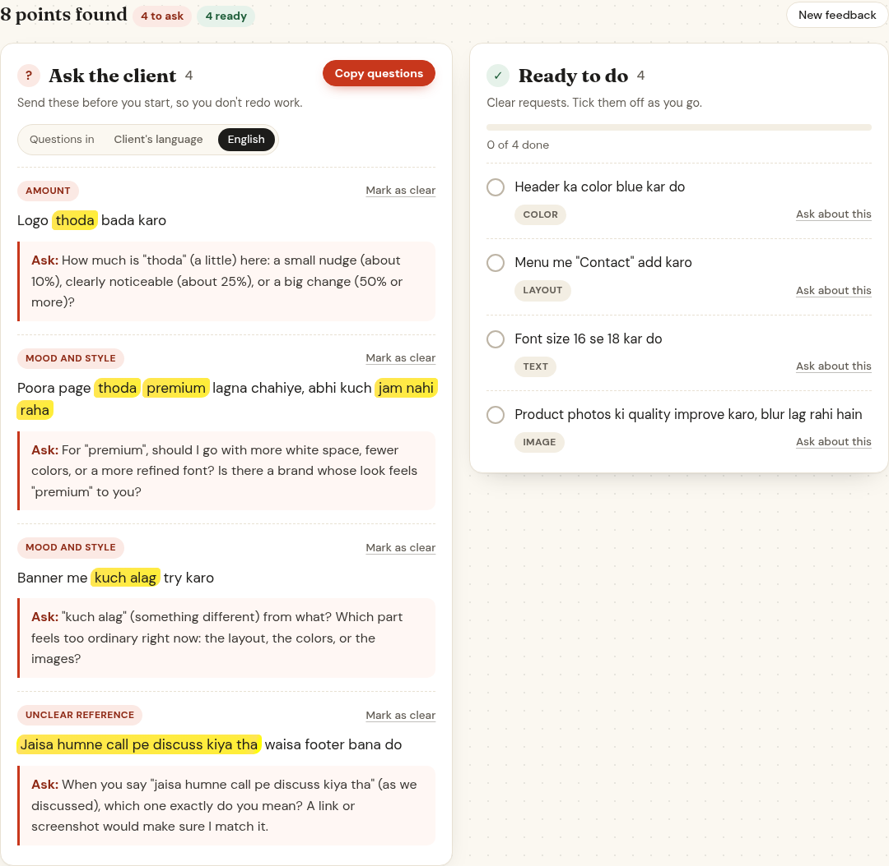

# Make It Pop

**Paste your client's messy feedback. Get a clear to-do list, plus the exact questions to ask about the vague bits.**



## The problem

Clients rarely send clean briefs. They send WhatsApp messages like:

> Logo thoda bada karo. Poora page thoda premium lagna chahiye, abhi kuch jam nahi raha. Banner me kuch alag try karo.

Some of that is a clear task. Some of it ("thoda", "premium", "kuch alag", "make it pop") is too vague to act on. Designers guess, the client says "not this", and a revision round is lost. Video editors, writers and social media managers deal with the same thing every week.

## What it does

1. **Paste** the client's message (WhatsApp chat exports, email, anything; English or Hinglish).
2. **Decode** splits it into separate points, drops greetings and thanks, and sorts every point into:
   - **Ask the client:** vague points, with the vague words highlighted, a label for the kind of vagueness (Mood and style, Mixed signals, Amount, Unclear reference and more) and one clarifying question that quotes the client's own words. Questions appear in the client's language, or switch every question to English (Hinglish words get a short English meaning, like "kuch alag" (something different)).
   - **Ready to do:** clear requests as a checklist with small tags (Text, Color, Image, Layout).
3. **Copy questions** puts one ready-to-send message on your clipboard: greeting, numbered questions, thanks.
4. **Tick tasks off** as you work, and move any point between the lists with one tap if the app guessed wrong.

## Try it

- **No install:** download or clone this repository and open `index.html` in any modern browser.
- Or serve the folder: `npx serve .` and open the printed address.
- Press **English sample** or **Hinglish sample**, then **Decode**.

## How it works

Everything runs in your browser, so client messages never leave your device and there is nothing to pay for.

- `js/phrases.js` is a hand-made library of vague phrases in English and Hinglish ("make it pop", "premium", "thoda", "kuch alag", "jaisa discuss kiya tha", "bigger but subtle" and many more), grouped by kind, with a question template for each kind in both languages.
- `js/decoder.js` cleans the text, splits it into points, finds vague phrases (including contradictions like "bada karo but subtle"), detects Hinglish, writes the question and builds the copy message. It has no page code, so it is tested directly with Node.
- `js/app.js` draws the lists, highlights the vague words safely, and handles ticking, moving, copying and starting over.

## Run the checks

```
node --test
```

Requires Node.js 20 or newer. No packages to install.

## How it was built

Built by [designerajitrawat-ux](https://github.com/designerajitrawat-ux) for Devpost's **Build With AI: Basics** hackathon, using the Devpost Learn skill pack with an AI coding agent: planning first, building after. The planning documents are in [`devpost/`](devpost/): [scope](devpost/scope.md), [product requirements](devpost/prd.md), [technical spec](devpost/spec.md) and the [build checklist](devpost/checklist.md).

Fonts: [Fraunces](https://fonts.google.com/specimen/Fraunces) and [DM Sans](https://fonts.google.com/specimen/DM+Sans) from Google Fonts (SIL Open Font License).

## License

[MIT](LICENSE)
